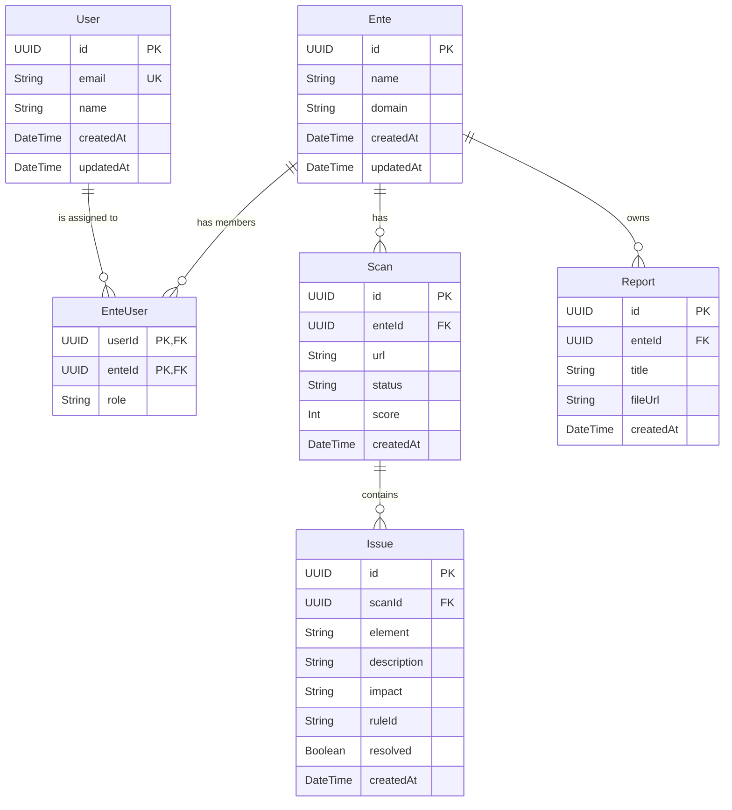

# Questo documento visualizza le relazioni tra i modelli definiti in `prisma/schema.prisma`

Questo è uno Snippet del Diagramma ER per ottenerlo stiamo utilizzando Mermaid.js un linguaggio testuale che genera automaticamente i diagrammi. Supportato nativamente da Github e anche dall'anteprima Markdown di VS Code. Se infatti lo si visualliza dentro un file README.md (come in questo caso) lo si vede direttamente come grafico.

